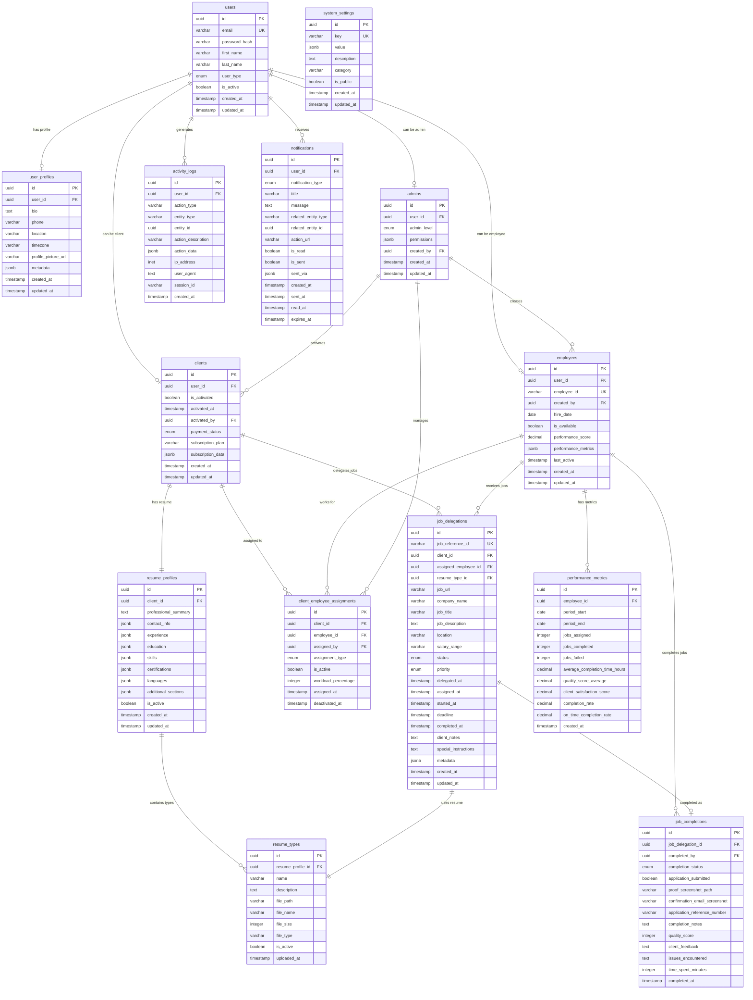

# Job Application Delegation System
## Database Schema Diagrams

---

## 🔗 **Mermaid ERD Format**

For documentation and markdown files:



---


## 🎯 **DbDiagram.io Format**

Copy this code to [dbdiagram.io](https://dbdiagram.io) for interactive database visualization:

```sql
// Job Application Delegation System Database Schema

Table users {
  id uuid [primary key]
  email varchar(255) [unique, not null]
  password_hash varchar(255) [not null]
  first_name varchar(100) [not null]
  last_name varchar(100) [not null]
  user_type user_type_enum [not null] // 'super_admin', 'admin', 'client', 'employee'
  is_active boolean [default: true]
  created_at timestamp [default: `now()`]
  updated_at timestamp [default: `now()`]
  
  indexes {
    email [unique]
    (user_type, is_active)
    created_at
  }
}

Table user_profiles {
  id uuid [primary key]
  user_id uuid [ref: > users.id, not null]
  bio text
  phone varchar(20)
  location varchar(255)
  timezone varchar(50)
  profile_picture_url varchar(500)
  metadata jsonb // Additional flexible data
  created_at timestamp [default: `now()`]
  updated_at timestamp [default: `now()`]
}

Table clients {
  id uuid [primary key]
  user_id uuid [ref: > users.id, not null, unique]
  is_activated boolean [default: false]
  activated_at timestamp
  activated_by uuid [ref: > users.id] // Admin who activated
  payment_status payment_status_enum [default: 'pending'] // 'pending', 'paid', 'overdue', 'cancelled'
  subscription_plan varchar(50)
  subscription_data jsonb // Billing info, plan details
  created_at timestamp [default: `now()`]
  updated_at timestamp [default: `now()`]
  
  indexes {
    (is_activated, payment_status)
    activated_at
  }
}

Table employees {
  id uuid [primary key]
  user_id uuid [ref: > users.id, not null, unique]
  employee_id varchar(20) [unique] // Human-readable ID like EMP001
  created_by uuid [ref: > users.id, not null] // Admin who created
  hire_date date [default: `now()`]
  is_available boolean [default: true]
  performance_score decimal(3,2) // 0.00 to 5.00
  performance_metrics jsonb // Detailed performance data
  last_active timestamp
  created_at timestamp [default: `now()`]
  updated_at timestamp [default: `now()`]
  
  indexes {
    employee_id [unique]
    (is_available, performance_score)
    last_active
  }
}

Table admins {
  id uuid [primary key]
  user_id uuid [ref: > users.id, not null, unique]
  admin_level admin_level_enum [default: 'standard'] // 'super', 'standard'
  permissions jsonb // Specific permissions
  created_by uuid [ref: > users.id] // Super admin who created
  created_at timestamp [default: `now()`]
  updated_at timestamp [default: `now()`]
}

Table resume_profiles {
  id uuid [primary key]
  client_id uuid [ref: > clients.id, not null]
  professional_summary text
  contact_info jsonb // Phone, email, LinkedIn, etc.
  experience jsonb // Array of work experiences
  education jsonb // Array of education entries
  skills jsonb // Array of skills with categories
  certifications jsonb // Array of certifications
  languages jsonb // Array of languages with proficiency
  additional_sections jsonb // Custom sections
  is_active boolean [default: true]
  created_at timestamp [default: `now()`]
  updated_at timestamp [default: `now()`]
  
  indexes {
    client_id
    is_active
  }
}

Table resume_types {
  id uuid [primary key]
  resume_profile_id uuid [ref: > resume_profiles.id, not null]
  name varchar(100) [not null] // "Data Analyst", "Software Engineer", etc.
  description text
  file_path varchar(500) [not null]
  file_name varchar(255) [not null]
  file_size integer // Size in bytes
  file_type varchar(20) [default: 'pdf']
  is_active boolean [default: true]
  uploaded_at timestamp [default: `now()`]
  
  indexes {
    resume_profile_id
    (resume_profile_id, is_active)
    name
  }
}

Table client_employee_assignments {
  id uuid [primary key]
  client_id uuid [ref: > clients.id, not null]
  employee_id uuid [ref: > employees.id, not null]
  assigned_by uuid [ref: > users.id, not null] // Admin who made assignment
  assignment_type assignment_type_enum [default: 'primary'] // 'primary', 'backup', 'temporary'
  is_active boolean [default: true]
  workload_percentage integer [default: 100] // Percentage of client's jobs this employee handles
  assigned_at timestamp [default: `now()`]
  deactivated_at timestamp
  
  indexes {
    (client_id, is_active)
    (employee_id, is_active)
    (client_id, employee_id, is_active) [unique]
  }
}

Table job_delegations {
  id uuid [primary key]
  job_reference_id varchar(50) [unique] // Human-readable ID like JOB-2024-001
  client_id uuid [ref: > clients.id, not null]
  assigned_employee_id uuid [ref: > employees.id]
  resume_type_id uuid [ref: > resume_types.id, not null]
  
  // Job Details
  job_url varchar(1000) [not null]
  company_name varchar(255) [not null]
  job_title varchar(255)
  job_description text
  location varchar(255)
  salary_range varchar(100)
  
  // Status & Priority
  status job_status_enum [default: 'pending'] // 'pending', 'assigned', 'in_progress', 'completed', 'failed', 'cancelled'
  priority priority_enum [default: 'normal'] // 'low', 'normal', 'high', 'urgent'
  
  // Timing
  delegated_at timestamp [default: `now()`]
  assigned_at timestamp
  started_at timestamp
  deadline timestamp
  completed_at timestamp
  
  // Additional Data
  client_notes text
  special_instructions text
  metadata jsonb // Flexible additional data
  
  created_at timestamp [default: `now()`]
  updated_at timestamp [default: `now()`]
  
  indexes {
    job_reference_id [unique]
    (client_id, status)
    (assigned_employee_id, status)
    (status, priority, delegated_at)
    deadline
    delegated_at
  }
}

Table job_completions {
  id uuid [primary key]
  job_delegation_id uuid [ref: > job_delegations.id, not null, unique]
  completed_by uuid [ref: > employees.id, not null]
  
  // Completion Details
  completion_status completion_status_enum [not null] // 'successful', 'failed', 'partial'
  application_submitted boolean [default: false]
  
  // Proof & Documentation
  proof_screenshot_path varchar(500)
  confirmation_email_screenshot varchar(500)
  application_reference_number varchar(100)
  completion_notes text
  
  // Quality Metrics
  quality_score integer // 1-10 rating
  client_feedback text
  issues_encountered text
  
  // Timing
  time_spent_minutes integer
  completed_at timestamp [not null, default: `now()`]
  
  indexes {
    job_delegation_id [unique]
    completed_by
    completion_status
    completed_at
  }
}

Table activity_logs {
  id uuid [primary key]
  user_id uuid [ref: > users.id, not null]
  
  // Action Details
  action_type varchar(50) [not null] // 'login', 'job_delegated', 'job_completed', etc.
  entity_type varchar(50) // 'job', 'user', 'assignment', etc.
  entity_id uuid // ID of the affected entity
  
  // Action Data
  action_description varchar(500)
  action_data jsonb // Detailed action information
  
  // Request Context
  ip_address inet
  user_agent text
  session_id varchar(255)
  
  created_at timestamp [default: `now()`]
  
  indexes {
    user_id
    (user_id, created_at)
    action_type
    entity_type
    created_at
  }
}

Table notifications {
  id uuid [primary key]
  user_id uuid [ref: > users.id, not null]
  
  // Notification Content
  notification_type notification_type_enum [not null] // 'job_assigned', 'job_completed', 'deadline_reminder', etc.
  title varchar(255) [not null]
  message text [not null]
  
  // Notification Data
  related_entity_type varchar(50) // 'job', 'assignment', etc.
  related_entity_id uuid
  action_url varchar(500) // Deep link to relevant page
  
  // Status
  is_read boolean [default: false]
  is_sent boolean [default: false]
  sent_via jsonb // ['email', 'push', 'in_app']
  
  // Timing
  created_at timestamp [default: `now()`]
  sent_at timestamp
  read_at timestamp
  expires_at timestamp
  
  indexes {
    user_id
    (user_id, is_read)
    notification_type
    (created_at, is_read)
    expires_at
  }
}

Table system_settings {
  id uuid [primary key]
  key varchar(100) [unique, not null]
  value jsonb [not null]
  description text
  category varchar(50) [default: 'general']
  is_public boolean [default: false] // Can non-admin users see this?
  created_at timestamp [default: `now()`]
  updated_at timestamp [default: `now()`]
  
  indexes {
    key [unique]
    category
  }
}

Table performance_metrics {
  id uuid [primary key]
  employee_id uuid [ref: > employees.id, not null]
  
  // Metrics Period
  period_start date [not null]
  period_end date [not null]
  
  // Performance Data
  jobs_assigned integer [default: 0]
  jobs_completed integer [default: 0]
  jobs_failed integer [default: 0]
  average_completion_time_hours decimal(5,2)
  quality_score_average decimal(3,2)
  client_satisfaction_score decimal(3,2)
  
  // Calculated Metrics
  completion_rate decimal(5,2) // Percentage
  on_time_completion_rate decimal(5,2) // Percentage
  
  created_at timestamp [default: `now()`]
  
  indexes {
    employee_id
    (employee_id, period_start, period_end)
    period_start
  }
}

// Enums
enum user_type_enum {
  super_admin
  admin
  client
  employee
}

enum payment_status_enum {
  pending
  paid
  overdue
  cancelled
  refunded
}

enum admin_level_enum {
  super
  standard
}

enum assignment_type_enum {
  primary
  backup
  temporary
}

enum job_status_enum {
  pending
  assigned
  in_progress
  completed
  failed
  cancelled
  on_hold
}

enum priority_enum {
  low
  normal
  high
  urgent
}

enum completion_status_enum {
  successful
  failed
  partial
  requires_review
}

enum notification_type_enum {
  job_assigned
  job_completed
  deadline_reminder
  deadline_missed
  account_activated
  assignment_changed
  performance_alert
  system_announcement
}
```
---

## 📊 **Key Database Insights**

### **Table Relationships Summary**
- **Users**: Central authentication table with role-based access
- **Profiles**: Extended user information for each role type
- **Assignments**: Many-to-many relationship between clients and employees
- **Jobs**: Complete workflow from delegation to completion
- **Tracking**: Comprehensive activity logging and notifications

### **Performance Considerations**
- **Indexes**: Optimized for common query patterns
- **Partitioning**: Activity logs can be partitioned by date
- **Caching**: Frequently accessed data cached in Redis
- **Archiving**: Completed jobs older than 1 year can be archived

### **Scalability Features**
- **UUID Primary Keys**: Supports distributed systems
- **JSONB Fields**: Flexible schema evolution
- **Enum Types**: Controlled vocabulary with database constraints
- **Soft Deletes**: Most entities use `is_active` flags instead of hard deletes

### **Security Features**
- **Audit Trail**: Complete activity logging
- **Data Encryption**: Sensitive fields encrypted at rest
- **Access Control**: Role-based permissions system
- **Data Retention**: Configurable retention policies

---

## 🛠️ **Usage Instructions**

1. **For DbDiagram.io**: Copy the SQL code above and paste it into [dbdiagram.io](https://dbdiagram.io) for an interactive visualization
2. **For Documentation**: Use the Mermaid ERD in your README files or documentation
3. **For Development**: Use this schema as a reference for Django model creation
4. **For Database Setup**: Generate migration scripts from this schema design

Both diagrams represent the same database structure but serve different purposes:
- **DbDiagram**: Interactive exploration and team collaboration
- **Mermaid**: Documentation and version control integration
