# Job Application Delegation System
## Technical Flow & Architecture Document

---

## 🏗️ **System Architecture Overview**

### **High-Level Architecture**

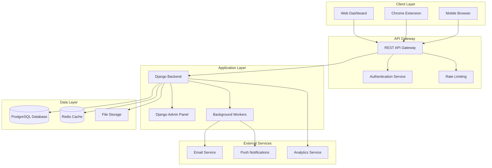

### **Technology Stack**

| Component | Technology | Purpose |
|-----------|------------|---------|
| **Backend Framework** | Django 4.2+ | Web framework with built-in admin |
| **Database** | PostgreSQL 15+ | Primary data storage |
| **Cache** | Redis 7+ | Session management, job queues |
| **API** | Django REST Framework | RESTful API endpoints |
| **Task Queue** | Celery + Redis | Background job processing |
| **File Storage** | AWS S3 / Local Storage | Resume PDFs, screenshots |
| **Frontend** | HTML5 + JavaScript | Responsive web dashboard |
| **Extension** | Chrome Extension (MV3) | Browser integration |
| **Authentication** | JWT + Session Auth | Secure user authentication |

---

## 🗄️ **Database Schema Design**

### **Entity Relationship Diagram**

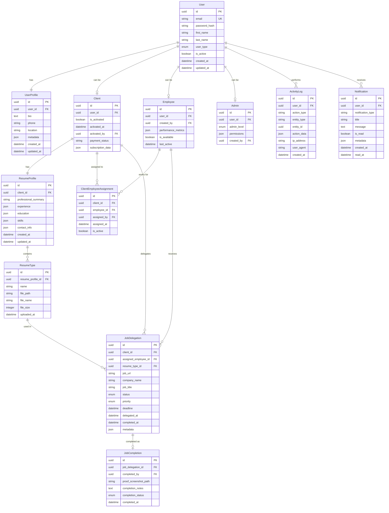

### **Key Database Constraints & Indexes**

```sql
-- Primary indexes for performance
CREATE INDEX idx_job_delegation_client_status ON job_delegation(client_id, status);
CREATE INDEX idx_job_delegation_employee_status ON job_delegation(assigned_employee_id, status);
CREATE INDEX idx_activity_log_user_date ON activity_log(user_id, created_at DESC);

-- Unique constraints
ALTER TABLE client_employee_assignment 
ADD CONSTRAINT unique_active_assignment 
UNIQUE(client_id, employee_id, is_active) 
WHERE is_active = true;

-- Check constraints
ALTER TABLE job_delegation 
ADD CONSTRAINT valid_deadline 
CHECK (deadline > delegated_at);
```

---

## 🔄 **API Flow Architecture**

### **Authentication Flow**

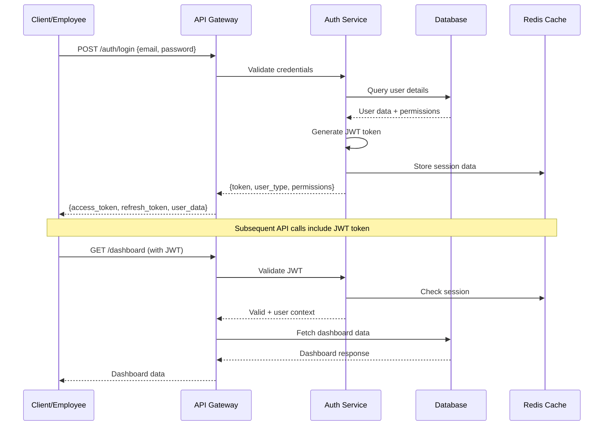

### **Job Delegation Flow**

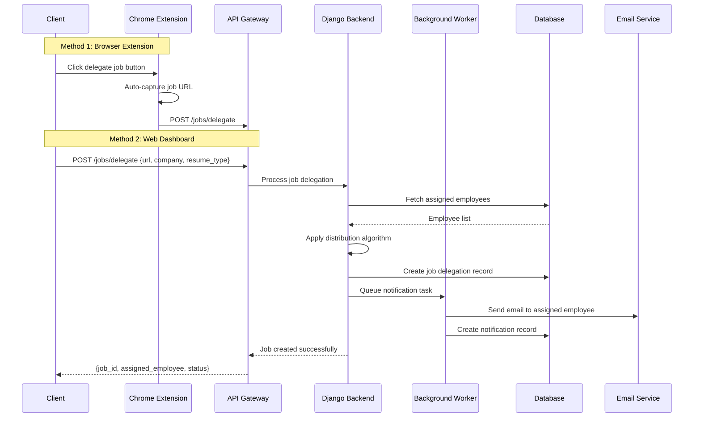

### **Job Completion Flow**

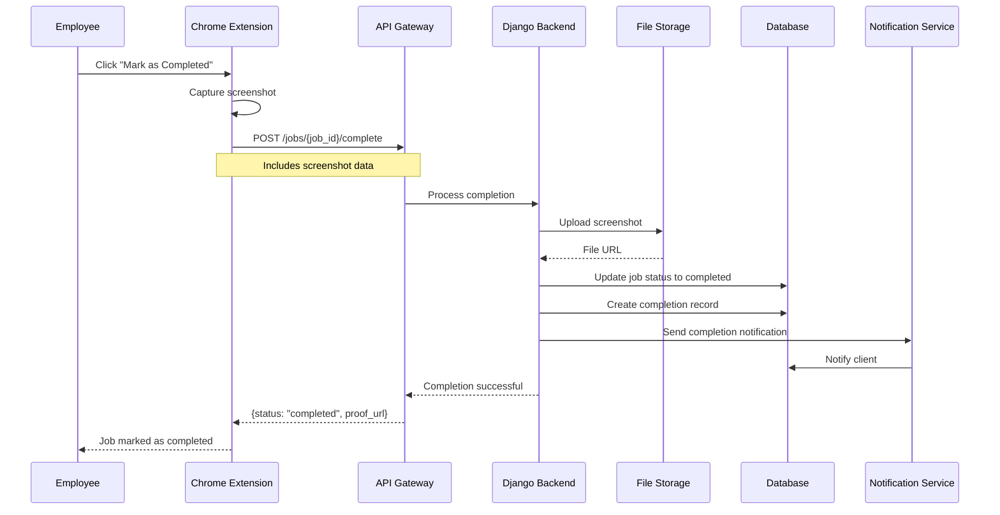

---

## 🔧 **Technical Components**

### **Django Backend Structure**

```
project/
├── apps/
│   ├── authentication/          # User management & auth
│   │   ├── models.py           # User, Profile models
│   │   ├── views.py            # Auth endpoints
│   │   ├── serializers.py      # API serializers
│   │   └── permissions.py      # Role-based permissions
│   │
│   ├── users/                  # User roles & profiles
│   │   ├── models.py           # Client, Employee, Admin
│   │   ├── views.py            # User management
│   │   └── admin.py            # Django admin config
│   │
│   ├── jobs/                   # Job delegation system
│   │   ├── models.py           # JobDelegation, Completion
│   │   ├── views.py            # Job CRUD operations
│   │   ├── tasks.py            # Celery background tasks
│   │   └── algorithms.py       # Distribution algorithms
│   │
│   ├── resumes/                # Resume management
│   │   ├── models.py           # ResumeProfile, ResumeType
│   │   ├── views.py            # Resume CRUD
│   │   └── file_handlers.py    # PDF upload/processing
│   │
│   ├── notifications/          # Real-time notifications
│   │   ├── models.py           # Notification models
│   │   ├── views.py            # Notification API
│   │   └── channels.py         # WebSocket handlers
│   │
│   └── analytics/              # Performance metrics
│       ├── models.py           # ActivityLog, Metrics
│       ├── views.py            # Analytics API
│       └── aggregators.py      # Data aggregation
│
├── api/
│   ├── v1/                     # API version 1
│   │   ├── urls.py            # URL routing
│   │   └── routers.py         # DRF routers
│   │
│   └── middleware/             # Custom middleware
│       ├── auth.py            # JWT middleware
│       ├── logging.py         # Request logging
│       └── rate_limiting.py   # API rate limiting
│
├── chrome_extension/
│   ├── manifest.json          # Extension manifest
│   ├── content_scripts/       # Page interaction
│   ├── popup/                 # Extension popup UI
│   ├── background/            # Background service worker
│   └── api/                   # API communication
│
└── frontend/
    ├── static/                # Static assets
    ├── templates/             # HTML templates
    └── js/                    # Dashboard JavaScript
```

### **Chrome Extension Architecture**

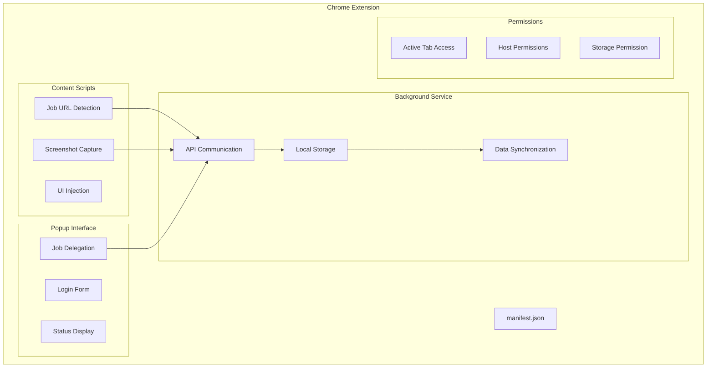

### **Background Task Processing**

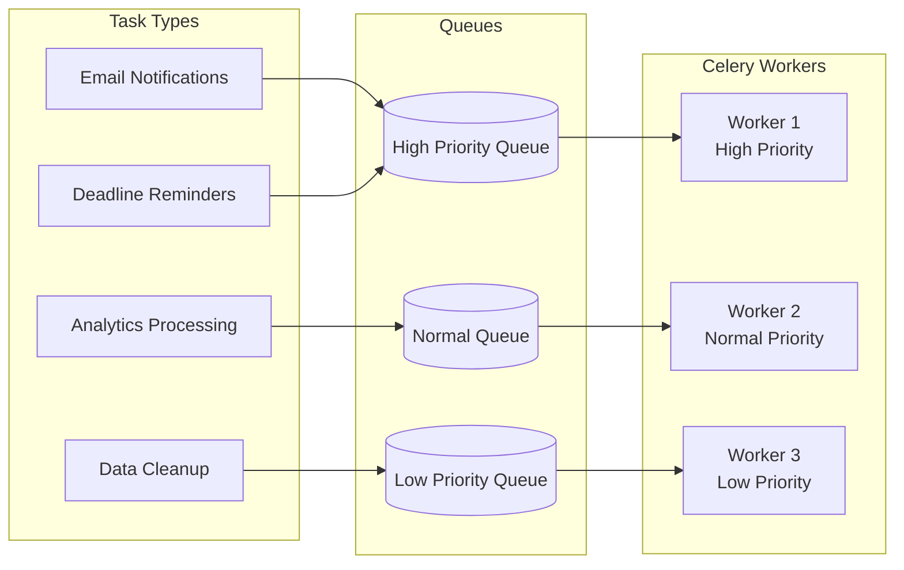

---

## 🔐 **Security Architecture**

### **Authentication & Authorization**

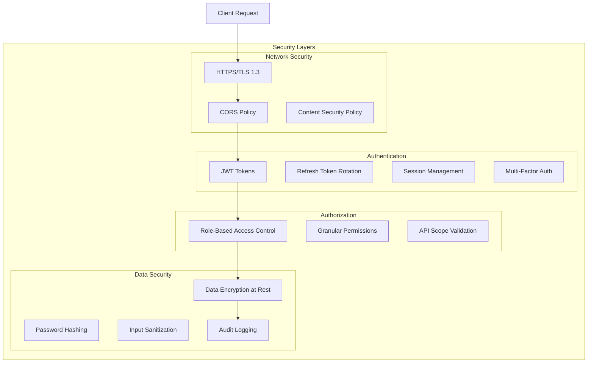

### **Role-Based Permissions Matrix**

| Resource | Super Admin | Admin | Client | Employee |
|----------|-------------|-------|--------|----------|
| **User Management** | ✅ Full | ✅ Limited | ❌ | ❌ |
| **Client Activation** | ✅ | ✅ | ❌ | ❌ |
| **Employee Assignment** | ✅ | ✅ | ❌ | ❌ |
| **Job Delegation** | ✅ View | ✅ View | ✅ Create | ❌ |
| **Job Processing** | ✅ View | ✅ View | ❌ | ✅ Process |
| **Resume Management** | ✅ View | ✅ View | ✅ Full | ✅ View |
| **Analytics** | ✅ Full | ✅ Basic | ✅ Personal | ✅ Personal |
| **System Settings** | ✅ | ❌ | ❌ | ❌ |

---

## 📊 **Performance & Scalability**

### **Caching Strategy**

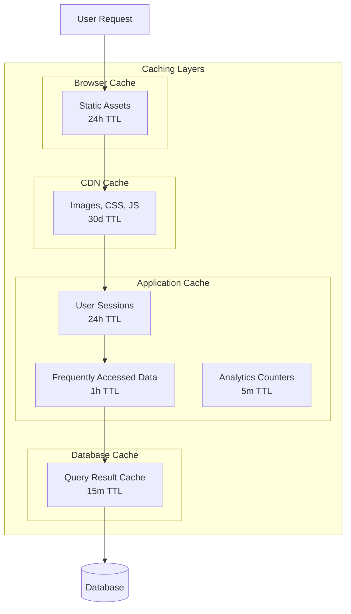

### **Database Optimization**

```sql
-- Performance optimization strategies

-- Partitioning for large tables
CREATE TABLE activity_log_2024_q1 PARTITION OF activity_log
FOR VALUES FROM ('2024-01-01') TO ('2024-04-01');

-- Materialized views for analytics
CREATE MATERIALIZED VIEW job_completion_stats AS
SELECT 
    client_id,
    COUNT(*) as total_jobs,
    COUNT(*) FILTER (WHERE status = 'completed') as completed_jobs,
    AVG(EXTRACT(EPOCH FROM (completed_at - delegated_at))/3600) as avg_completion_hours
FROM job_delegation 
WHERE delegated_at >= CURRENT_DATE - INTERVAL '30 days'
GROUP BY client_id;

-- Indexes for performance
CREATE INDEX CONCURRENTLY idx_job_delegation_composite 
ON job_delegation(client_id, status, delegated_at DESC);
```

---

## 🚀 **Deployment Architecture**

### **Production Infrastructure**

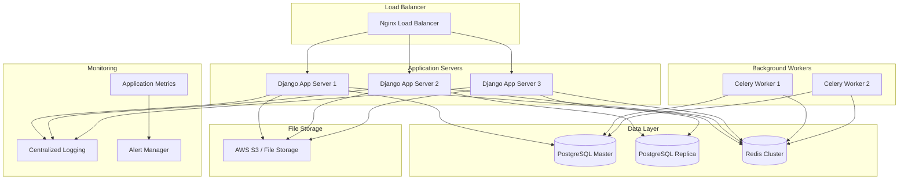

### **Environment Configuration**

| Environment | Purpose | Resources | Scaling |
|-------------|---------|-----------|---------|
| **Development** | Local development | 1 app server, SQLite | Manual |
| **Staging** | Testing & QA | 1 app server, PostgreSQL | Manual |
| **Production** | Live system | 3+ app servers, HA database | Auto-scaling |

---

## 📈 **Monitoring & Analytics**

### **Key Metrics to Track**

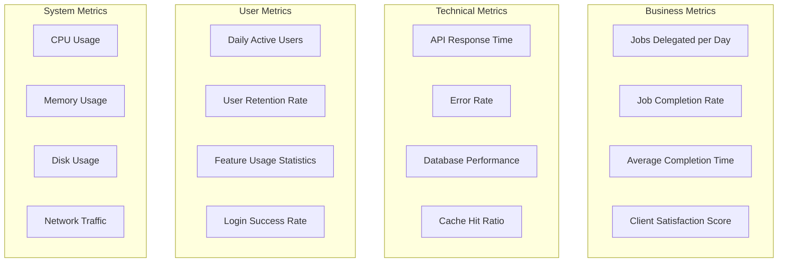

### **Alert Conditions**

| Metric | Warning Threshold | Critical Threshold | Action |
|--------|------------------|-------------------|---------|
| **API Response Time** | > 500ms | > 2000ms | Scale up servers |
| **Error Rate** | > 2% | > 5% | Immediate investigation |
| **Job Completion Rate** | < 85% | < 70% | Review assignments |
| **Database Connections** | > 80% | > 95% | Scale database |

---

## 🔄 **Integration Points**

### **External Service Integrations**

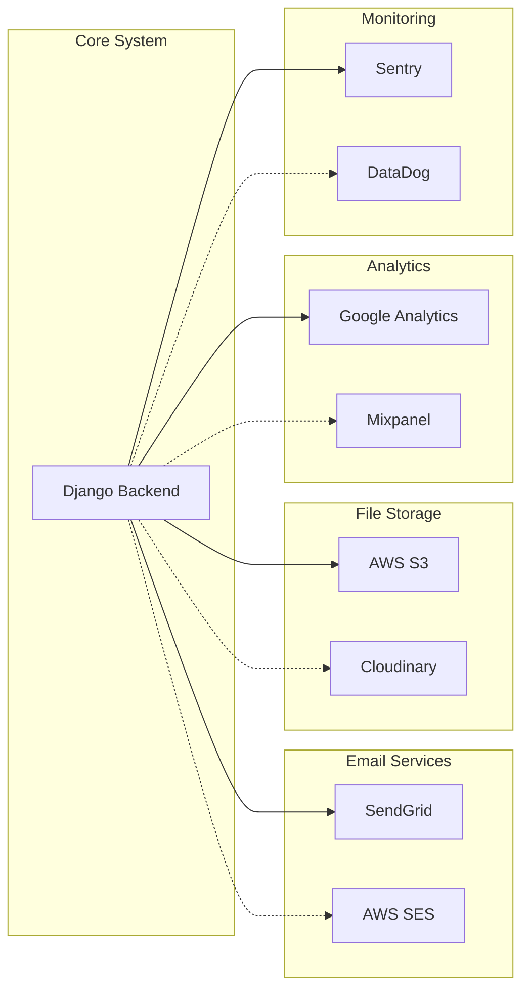

---

## 🔧 **Development Workflow**

### **CI/CD Pipeline**

```mermaid
graph LR
    DEV[Developer Push] --> GIT[Git Repository]
    GIT --> BUILD[Build & Test]
    BUILD --> QUALITY[Code Quality Checks]
    QUALITY --> STAGING[Deploy to Staging]
    STAGING --> TEST[Automated Testing]
    TEST --> APPROVE[Manual Approval]
    APPROVE --> PROD[Deploy to Production]
    PROD --> MONITOR[Post-deployment Monitoring]
```

### **Testing Strategy**

| Test Type | Coverage | Tools | Frequency |
|-----------|----------|-------|-----------|
| **Unit Tests** | 90%+ | pytest, unittest | Every commit |
| **Integration Tests** | Key flows | pytest-django | Every PR |
| **API Tests** | All endpoints | Postman/pytest | Daily |
| **E2E Tests** | Critical paths | Selenium/Playwright | Weekly |
| **Performance Tests** | Load testing | Locust | Monthly |

---

**This technical architecture provides a scalable, secure, and maintainable foundation for the Job Application Delegation System with clear separation of concerns and robust performance characteristics.**
